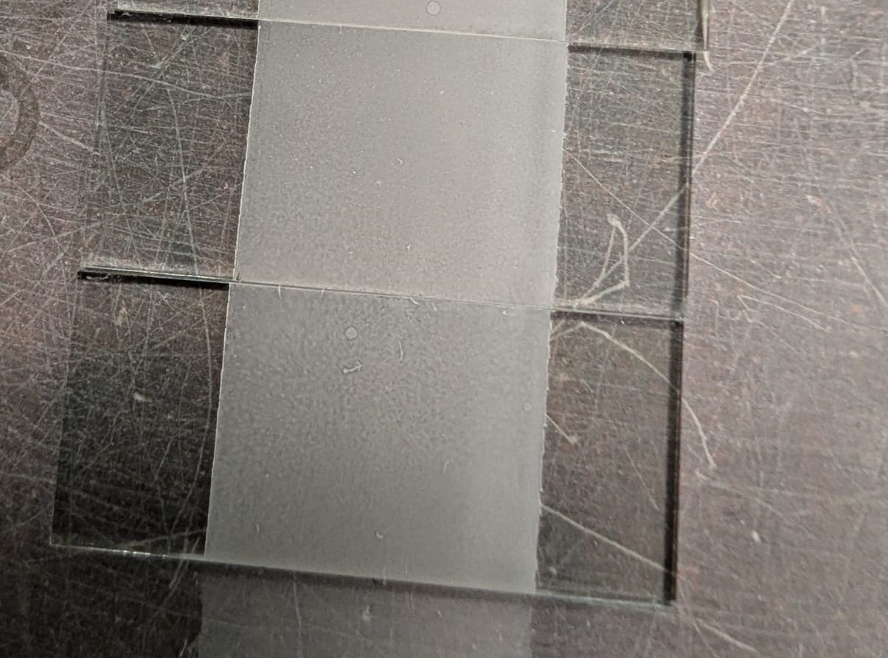

# Jericho-Projects

## Table of Contents
- [Nano-titania based chemical oxygen demand (COD) sensors](#nano-titania-based-chemical-oxygen-demand-cod-sensors)  
    - [Description](#description-cod-sensors)  
    - [Testing and Analysis](#testing-and-analysis-cod-sensors)  
    - [Results](#results-cod-sensors)  

- [AgNPs (nano silver) ink for flexible substrate applications (ongoing)](#agnps-nano-silver-ink-for-flexible-substrate-applications)  
    - [Description](#description-agnps-ink)  

- [Photocatalytic cell manufacturing for research paper (ongoing)](#photocatalytic-cell-manufacturing-for-research-paper)  
    - [Description](#description-photocatalytic-cell)

## Nano-titania based chemical oxygen demand (COD) sensors

### Description

This was an R&D project partnership between Nano & Micro Systems lab and MANTECH. My role was to develop and refine a deposition process for MANTECH’s chemical oxygen 
demand (COD) biosensor slides. This process is critical for enabling accurate COD measurement. I initially selected spray deposition due to its cost-effectiveness, rapid 
iteration potential, and scalability for large batch production. I then fine-tuned the solution's viscosity to optimize aerosolization, ensuring that the solution could 
be evenly sprayed onto the substrate with the desired thickness and uniformity. After the first iteration, I sent the slides to MANTECH for quality control testing using 
their PeCOD® device (a portable Photoelectrochemical COD analyzer). While the initial results were promising, they indicated room for improvement in better yield and 
adhesion. To enhance yield, I adjusted the tank pressure and the distance from the substrate, achieving thin, consistent layers without disruption from airflow. Adhesion 
improvements came from a substrate treatment method suggested by a PhD student in our group. After multiple iterations, the solution and deposition method were 
sufficiently optimized. I then created comprehensive documentation and instructional videos to ensure the process could be consistently replicated for future slide 
production. (Unfortunately I can not share these as they fall under an NDA)

### Testing and Analysis

- **X-ray Diffraction (XRD)** for phase (anatase/rutile) & crystallinity characterization.
- **Profilometry** to measure, then identify optimal thickness and uniformity.
- **UV-Vis Spectroscopy** to analyze the optical properties such as light absorbtion and transmition.  
- **Surface area + electrochemical analysis** for resistance and capacitance measurements. (Ran with PhD student)
- **PeCOD® analysis** for final testing & compatibility with device and longevity (adhesion).

### Results

Following thorough testing, this approach consistently met MANTECH’s quality standards, 
proving its reliability and repeatability. 
This method has now been adopted as the default for production, 
setting a new standard for efficiency and throughput. 
The successful integration of this deposition process not only enhanced the performance of 
the COD biosensors but also streamlined the production workflow, resulting in reduced 
lead times and lower operational costs. Feedback from MANTECH has been positive, 
noting significant improvements in product consistency and quality. 
Overall, this project established a strong foundation for my future projects in 
the materials/R&D engineering sector. 

## AgNPs (nano silver) ink for flexible substrate applications (ongoing)

### Description

Flexible electronics have gained significant attention since the early 20th century, with applications in wearable technology, flexible solar cells, and energy storage. As part of the University of Waterloo NanoRobotics Group (UWNRG), my team is developing a flex PCB printer.  

My primary focus is on researching and synthesizing conductive ink for printing on flexible substrates. I am currently exploring the use of AgNP (nano silver particle) ink, due to its high conductivity and compatibility with non-toxic solvents. Our initial tests will print simple patterns to assess the ink's conductivity, adhesion, and interaction with various flexible substrates. We hope to provide a device than can be used by other design teams and in creating future projects of our own.

## Photocatalytic cell manufacturing for research paper (ongoing)

Drawing on my experience in producing COD sensors, I am now focused on synthesizing and fabricating photocatalytic cells for PhD students at the university. These cells are designed for use in photoelectrochemical applications, such as pollutant degradation and water splitting, with potential solar energy conversion applications. The cells are still in the research and interation phase, here's a few iterations:

